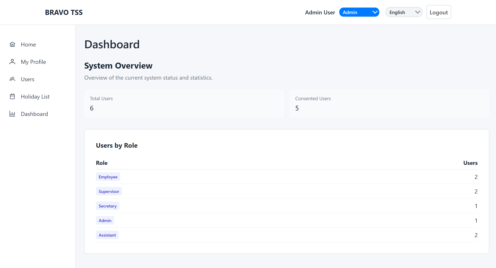
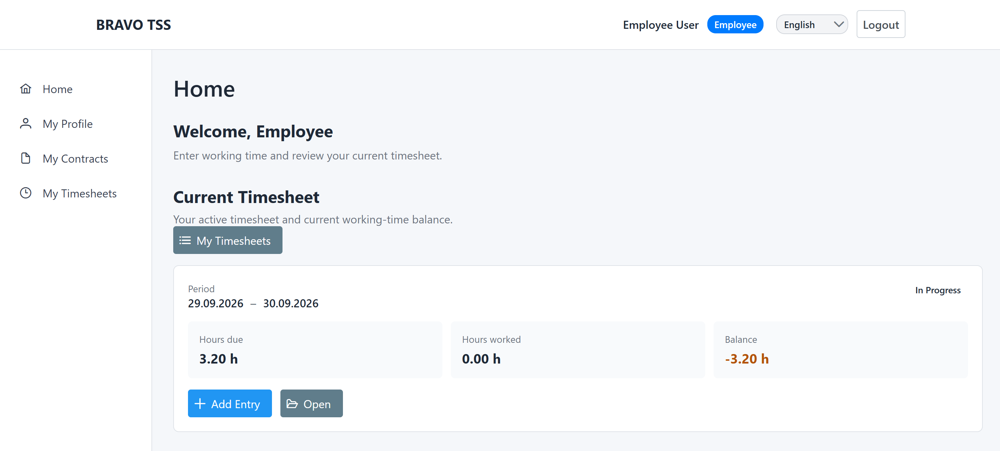
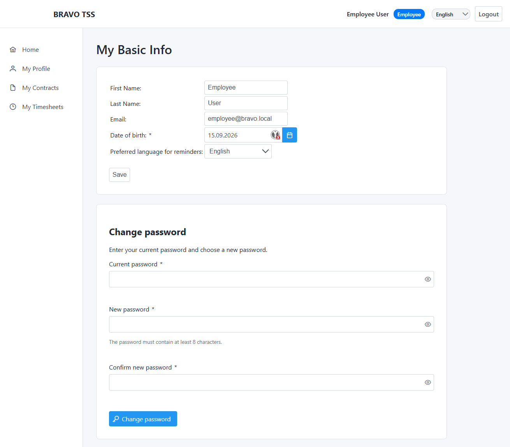
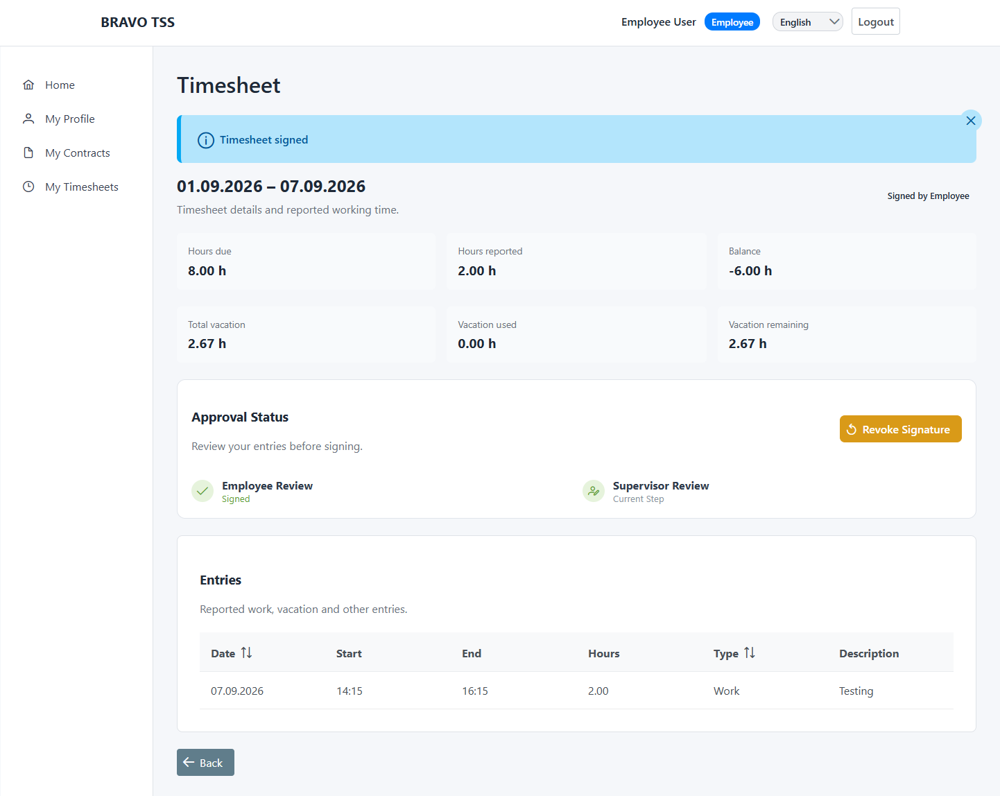

## Description

The Time Sheet System (TSS) is a Jakarta EE web application designed to support employees in recording and managing their working hours and time sheets under one or more employment contracts.

The system supports the time sheet process from contract management and recording working hours through signing and archiving. It is intended to support the time sheet process and reduce the effort and errors associated with paper- and spreadsheet-based solutions. The system keeps track of hours due and completed, provides statistics, and supports reminders for missing entries, reports, and signatures.

The TSS also provides functionality for managing contracts, viewing and managing time sheets, signing and archiving time sheets, and controlling access to personal data. Since the system processes sensitive personal information, it is designed to ensure that only authorized users can access the relevant data and to support privacy and confidentiality.

The project's documentation, including its architecture, requirements, project report, group rules, and meeting minutes, can be found in the [Project Wiki]https://github.com/PARTH-THAPS/Timesheet-System/wiki

## Visuals

The following images provide a brief visual overview of the BRAVO-TSS Time Sheet System. They show selected views of the application for different user roles and common tasks, including the administrator dashboard, the employee home page, the self-service area, and the signing of a time sheet. Together, the screenshots provide a small impression of the user interface and the main workflows supported by the system.

*Figure 1: Administrator Dashboard of BRAVO-TSS.*

*Figure 2: Employee Home Page of BRAVO-TSS.*

*Figure 3: Self-Service Area of BRAVO-TSS.*

*Figure 4: Signed Time Sheet of an Employee.*

The screenshots illustrate selected parts of the system and are intended to provide a visual impression of the implemented user interface. They do not represent all available views and functions of BRAVO-TSS.

## Configuration and Execution

The following software and resources are required to configure and run the project:

- **Java 21 (OpenJDK 21)**
- **Apache NetBeans 25**
- **GlassFish Server 7.0.21**
- **MariaDB (recent stable version)**
- **MariaDB Connector/J 3.5.8 or later**

We would like to thank Professor **Dr. Volker Riediger** for his helpful guidance throughout the project and implementation process. We also appreciate the interesting examples he provided, which offered valuable inspiration and helped us develop the Time Sheet System.
